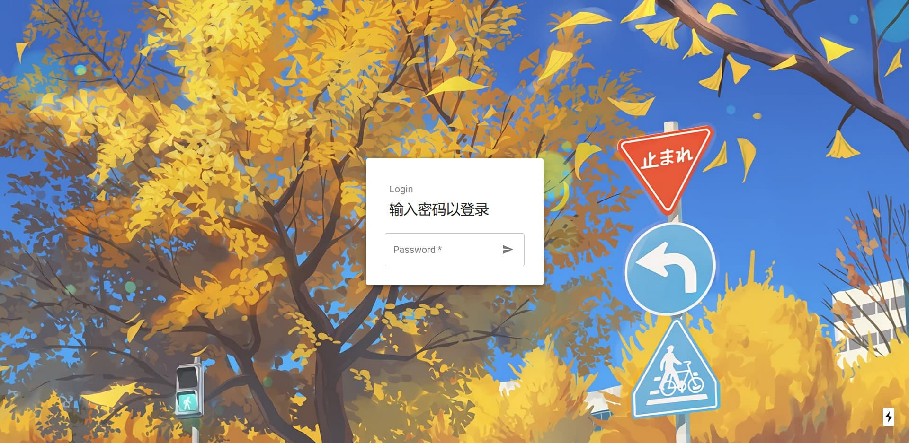
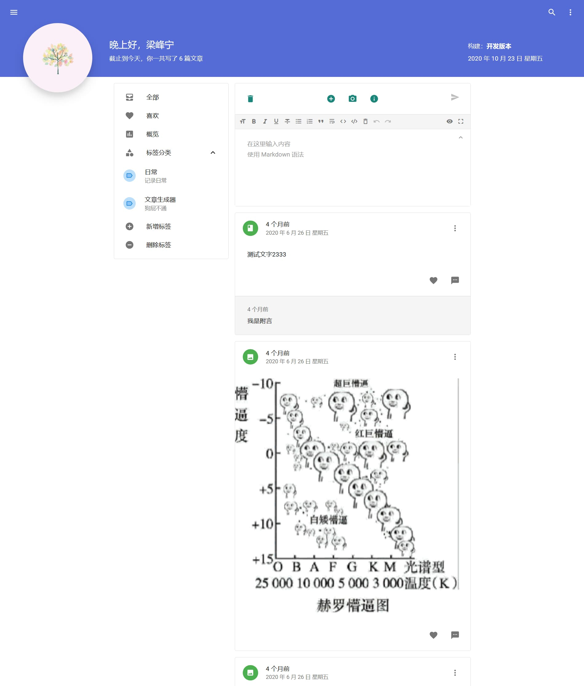
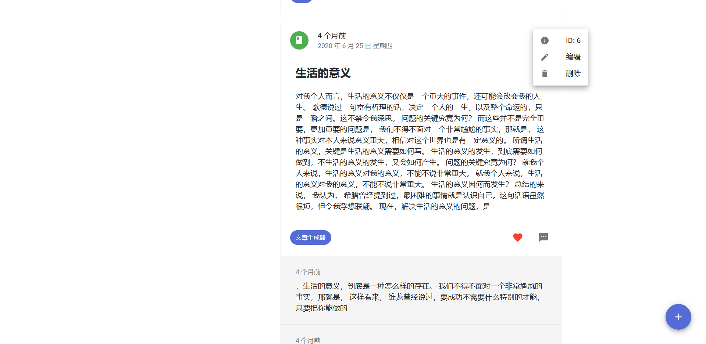
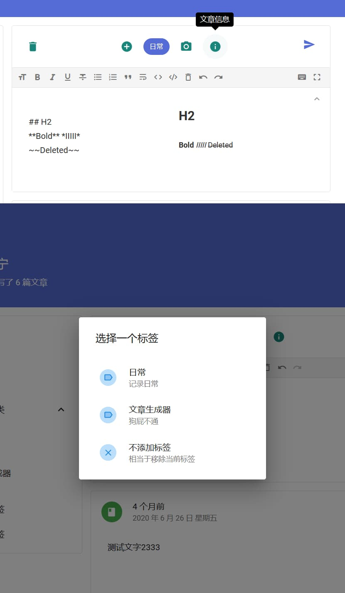
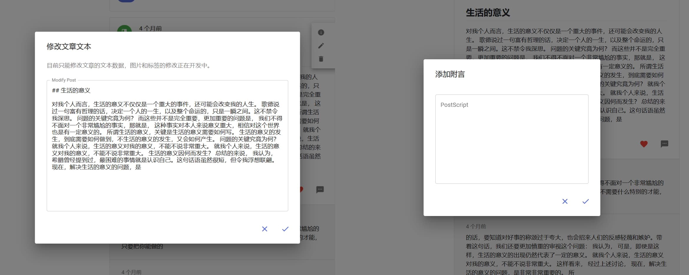
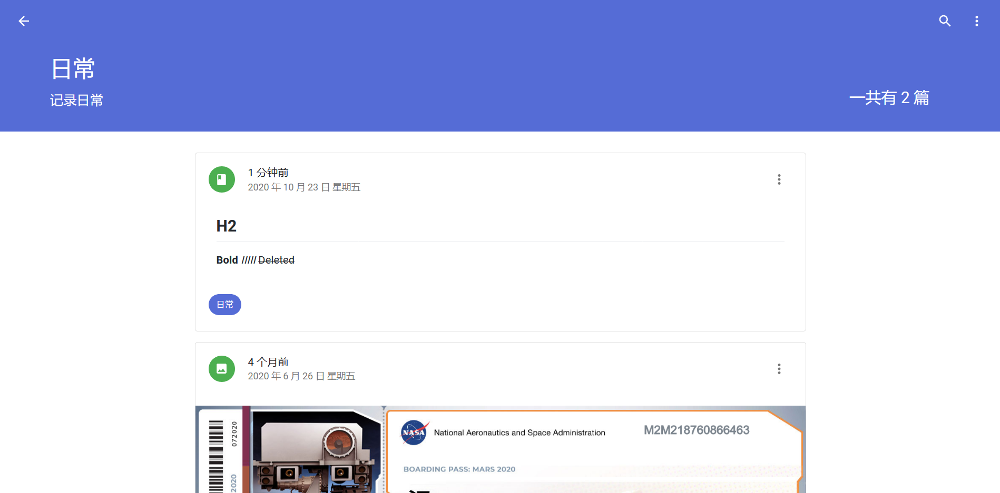
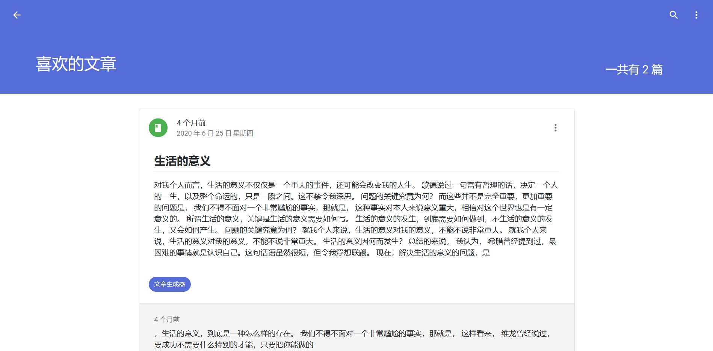
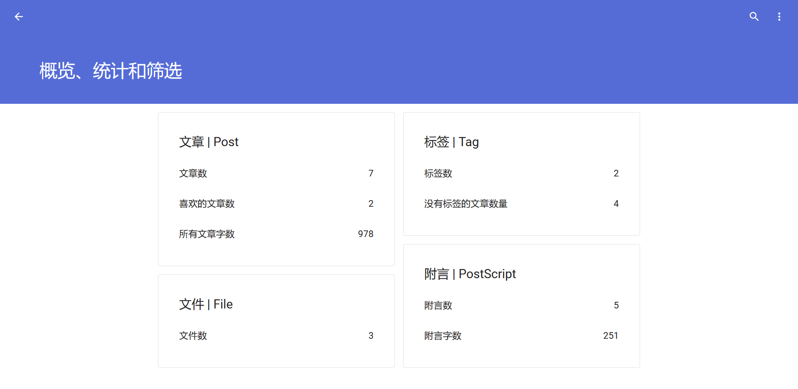

# 在这里记录

数据库课程设计，一个数据记录应用，计划做成可以自己部署的 Web 应用程序。

由于种种原因，这个项目暂时（也许是永远）停止开发和维护，不过这个项目的本意——数据记录，应该会在不久之后的另一个项目中出现，敬请期待。

## 用到的技术

- React

- Next.js

- Material-UI

- SQLite3

更多技术可以查看 package.json。

## 目前已经实现的功能

- 登录验证

- 基本的服务端渲染

- Markdown 的编辑与展示

- 记录的发布，包括图片的插入和标签的插入

- 记录的喜欢、附言和删除功能

- 标签的添加和删除，以及分类查看

- 喜欢的记录的查看

- 用户数据的统计功能

## 预览


















## 开发与配置

启动项目之前，需要编写两个配置文件（在项目根目录下的 `configs` 文件夹）：

1. `/configs/config.json` 存放使用者的基本信息，以及 OSS 配置，格式如下：
   
   ```json
   {
     "name": "Record",
     "description": "在这里记录。",
     "user": {
       "name": "Lifeni",
       "avatar": "https://example.com/avatar.jpg"
     },
     "oss": {
       "region": "...",
       "accessKeyId": "...",
       "accessKeySecret": "...",
       "bucket": "..."
     }
   }
   ```

2. `/configs/password.json` 存放登录密码和 JWT 加密秘钥，格式如下：
   
   ```json
   {
     "loginPassword": "1234",
     "jwtPassword": "1234"
   }
   ```

除了 Node.js 环境，编译 SQLite 还需要 Python2 环境。~~建议使用 cnpm 进行安装~~。

```bash
$ cnpm i
$ npm run dev
```

现在建议使用 Yarn 进行安装：

```bash
$ yarn
$ yarn dev
```
